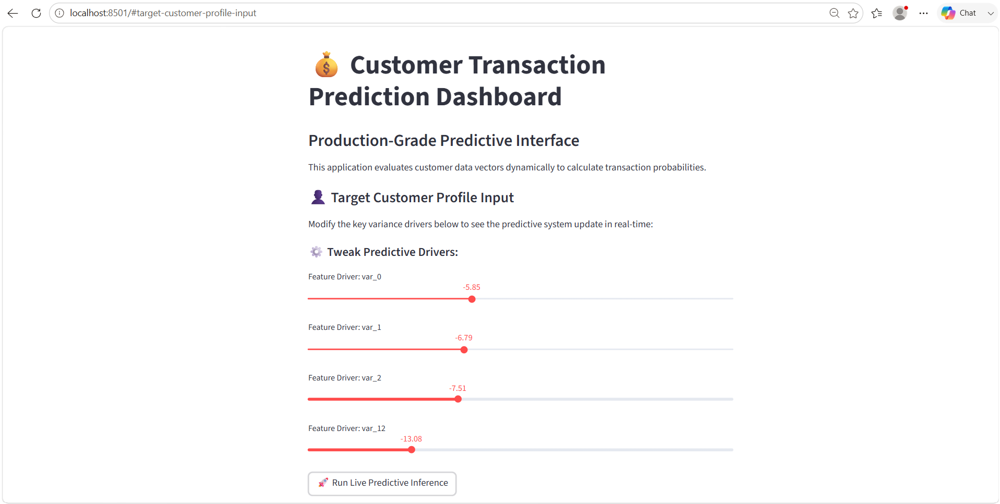
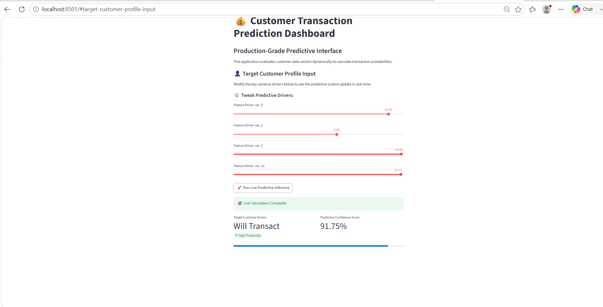

# Customer Transaction Prediction

## Project Overview

This project predicts whether a customer will make a transaction using Machine Learning.

The application is built using Streamlit and uses a trained LightGBM model for prediction.

---

## Features

- Predict customer transaction
- User-friendly Streamlit interface
- Pre-trained LightGBM model
- Data preprocessing using StandardScaler

---

## Technologies Used

- Python
- Pandas
- NumPy
- Scikit-Learn
- LightGBM
- Streamlit

---

## Application Screenshots

### Home Page

### Prediction Result

## Project Structure

Customer-Transaction-Prediction/

├── app.py

├── best_model_lightgbm.pkl

├── scaler.pkl

├── feature_columns.pkl

├── requirements.txt

├── README.md

---

## Installation

pip install -r requirements.txt

---

## Run the Project

streamlit run app.py

---

## Author

Supraja B